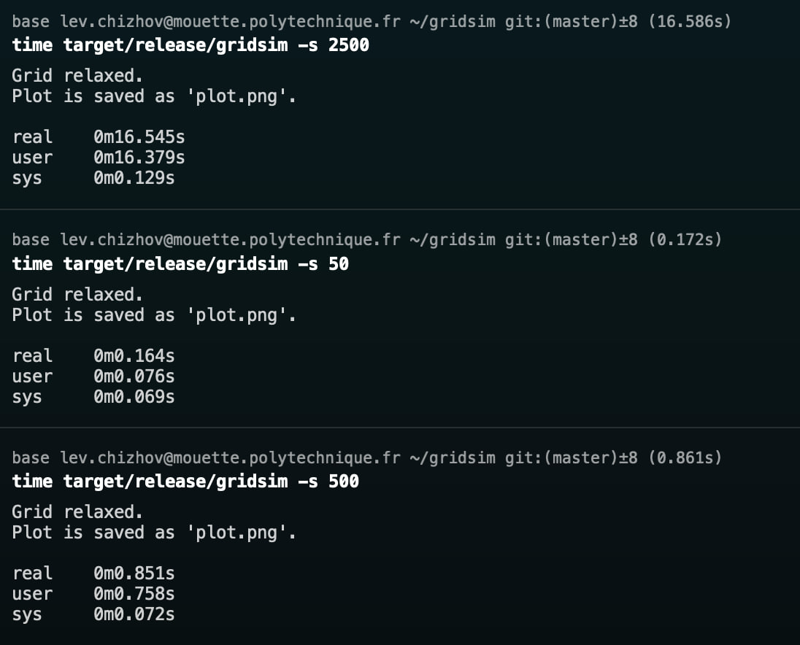

# Grid simulation

### Simple approach

`src/main_simple.rs`

On Mac M3 Pro:

For L=50 (100x100 grid), t=0.09s

For L=500, t=33.56s.

On bengali.polytechnique.fr:

For L=50, t=0.109s

For L=500, t=57.386s

### With CUDA acceleration

On a school machine mouette.polytechnique.fr:

For L=50, t=0.164s

For L=500, t=20.741s

For L=2500, t=16.245

